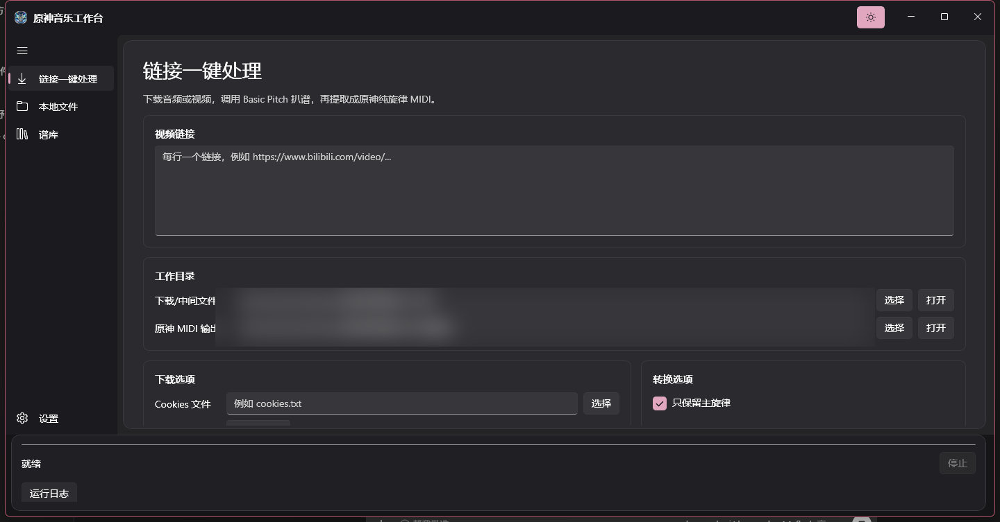
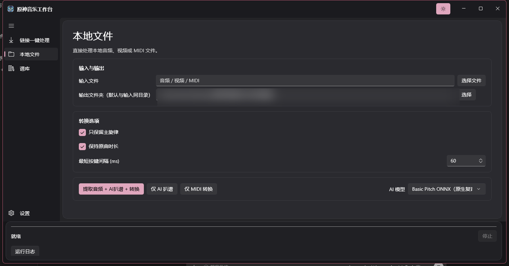
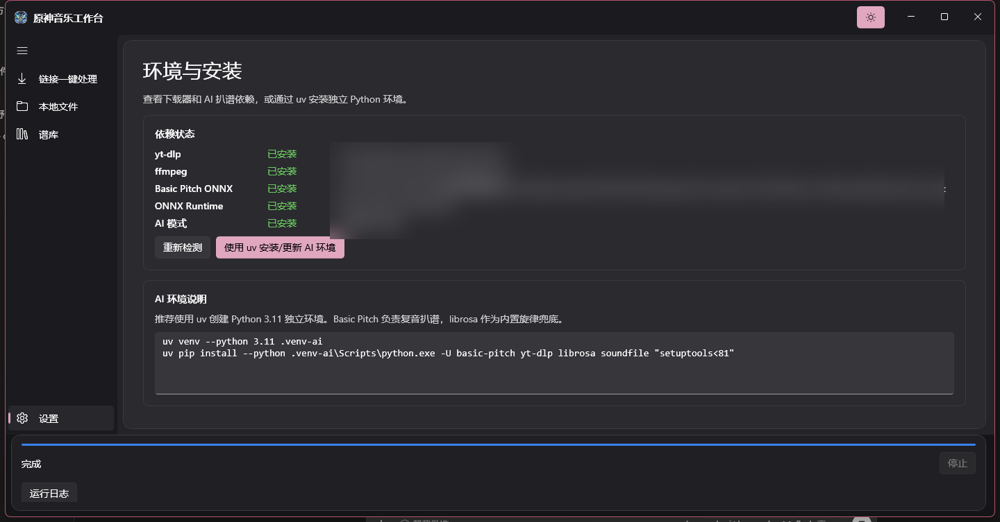
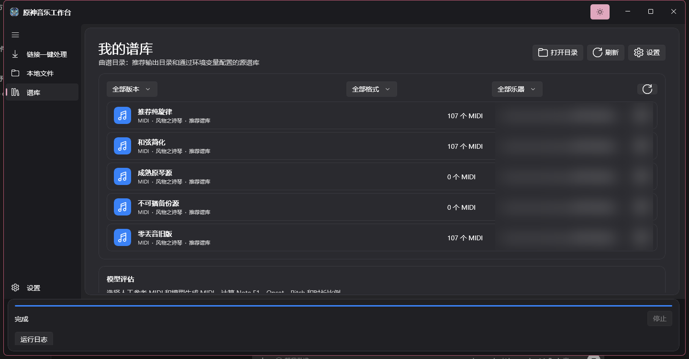

<p align="center">
  
</p>

<h1 align="center">Genshin Music Studio</h1>

<p align="center">Windows 原生 AI 扒谱、MIDI 优化与原神琴谱转换工具</p>

<p align="center">
  <a href="https://github.com/Akinome/genshin-music-studio/releases/latest"></a>
  
  
  
  <a href="LICENSE"></a>
</p>

## 功能概览

Genshin Music Studio 是一个 WinUI 3 桌面应用，用于：

- 从 Bilibili、YouTube 等 yt-dlp 支持的网站下载音频
- 使用多种模型进行 AI 扒谱
- 输出 `raw / optimized / genshin` 三份 MIDI
- 对 MIDI 做节拍量化、调性修正、碎片音合并和主旋律提取
- 将结果折叠到原神风物之诗琴音域
- 对比不同模型与人工谱的 Note F1、Onset 和 Pitch 指标
- 管理谱库目录：添加、删除、设为默认谱库，并把 MIDI 迁移到新位置
- 在环境页查看各模型安装状态，并按模型组选择性安装
- 应用内播放：独立播放页，瀑布流和 21 键键盘两种可视化模式
- 21 键键盘模式使用原神游戏采样的 12 种乐器发声，键位随演奏点亮

> AI 扒谱结果取决于音频质量、混音复杂度、模型和参数。项目不承诺所有歌曲都能 100% 还原。

## 界面截图

| 链接一键处理 | 本地文件 |
|---|---|
|  |  |

| 环境与安装 | 谱库与模型评估 |
|---|---|
|  |  |

## 支持的模型

| 模型 | 适用场景 | 运行方式 |
|---|---|---|
| Basic Pitch ONNX | 通用复音、快速处理 | C# 原生 ONNX Runtime，无 Python/TensorFlow |
| Piano Transcription | 纯钢琴、钢琴翻奏 | PyTorch CPU |
| Demucs 伴奏 + Piano | 器乐、钢琴与伴奏 | Demucs 分离后钢琴转录 |
| Demucs 人声 + CREPE | 人声主旋律 | 分离 + 单音音高跟踪 |
| CREPE | 独奏、哼唱、单音旋律 | PyTorch CPU |
| librosa pyin | 轻量旋律兜底 | librosa |

## 应用内播放

播放页选择 MIDI 文件后可以直接播放，无需自动演奏工具：

- **瀑布流模式**：音符按原神琴音域折叠后从上往下落，底部判定线，正在演奏的音符高亮
- **21 键键盘模式**：原神风物之诗琴的 3×7 圆形键布局，音符接近时接近环缩向键位，到达时键位点亮并按下
- **12 种原神乐器采样**：风物之诗琴、镜花之琴、镜花之琴(旧版)、老旧的诗琴、悠可琴、跃律琴、谐律键琴、余音、晚风圆号、沃雅妮莎、豪鼓、聚聚鼓——每个键位对应游戏解包的真实音频采样，多音自然混音
- 音量与音符力度实时可调，音频选择随应用记住

播放引擎为 NAudio 采样混音（MIT 协议），无额外下载。乐器采样与发声配置来自
[genshin.music](https://github.com/Specy/genshin-music) 项目。

## 三份 MIDI 输出

完整转换会生成：

```text
输出目录/
├── raw/
│   └── 歌名_raw.mid
├── optimized/
│   └── 歌名_optimized.mid
└── genshin/
    └── 歌名_genshin.mid
```

- `raw`：模型原始识别结果
- `optimized`：量化、调性、碎片音和八度修正后的结果
- `genshin`：最终单音、琴音域、最短按键间隔约束后的结果

“仅 AI 扒谱”模式只输出原始 MIDI，不做原神简化。

## 下载使用

前往 [Releases](https://github.com/Akinome/genshin-music-studio/releases/latest) 下载：

```text
GenshinMusicStudio-win-x64.zip
```

解压后：

双击 `GenshinMusicStudio.WinUI.exe` 运行。

基础 ONNX 扒谱不需要 Python。下载功能需要系统已安装：

```text
yt-dlp
ffmpeg
```

## 可选高级模型

钢琴、Demucs 和 CREPE 需要独立 Python 3.11 环境。

环境页会显示每个模型的安装状态（已安装/未安装）。点击“使用 uv 安装/更新 AI 环境”前，
可以先勾选需要的模型组（基础组、钢琴组、Demucs 组、CREPE 组），PyTorch 只会安装一次。

也可以双击发布包中的：

```text
install_ai_env_uv.bat
```

或手动执行：

```powershell
uv venv --python 3.11 .venv-ai
uv pip install --python .venv-ai\Scripts\python.exe torch torchaudio --index-url https://download.pytorch.org/whl/cpu
uv pip install --python .venv-ai\Scripts\python.exe -U yt-dlp librosa soundfile "setuptools<81"
uv pip install --python .venv-ai\Scripts\python.exe piano_transcription_inference demucs torchcrepe
```

高级模型依赖体积较大，且当前默认使用 CPU 推理。Demucs 和 CREPE 处理长歌曲会明显慢于 Basic Pitch。

## 从源码构建

环境要求：

- Windows 10 1809 或更高版本
- .NET 8 SDK
- Python 3.11 与 uv，用于高级模型

构建 WinUI：

```powershell
dotnet build GenshinMusicStudio.WinUI\GenshinMusicStudio.WinUI.csproj -c Debug
```

启动：

```powershell
dotnet run --project GenshinMusicStudio.WinUI\GenshinMusicStudio.WinUI.csproj -c Debug
```

生成自包含发布包：

```powershell
powershell -ExecutionPolicy Bypass -File packaging\package_release.ps1
```

输出：

```text
release\GenshinMusicStudio-win-x64\
release\GenshinMusicStudio-win-x64.zip
```

## 命令行工具

基础 MIDI 转换：

```powershell
python backend\midi_to_genshin.py 你的歌曲.mid
```

输出：

```text
你的歌曲_genshin.mid
```

模型评估：

```powershell
python backend\model_evaluator.py 人工参考.mid 模型输出.mid
```

可选环境变量：

```powershell
$env:GENSHIN_PLAYABLE_DIR = "D:\Music\成熟的原琴"
$env:GENSHIN_BACKUP_DIR = "D:\Music\不可播备份"
```

未设置时，批量分析工具会使用项目下的 `示例谱库` 目录。

## 项目结构

```text
GenshinMusicStudio.WinUI/   WinUI 3 原生应用
backend/                    Python 后端、模型调用与转换流水线
tools/                      批量处理、诊断和图标生成工具
scripts/                    启动和 AI 环境安装脚本
samples/                    示例 MIDI
packaging/                  Release 打包脚本
docs/images/                README 截图
```

## 已知限制

- 当前没有 NVIDIA GPU 加速路径
- Demucs、CREPE 和钢琴模型在 CPU 上较慢
- 复杂混音、混响重的录音和现场版本更容易识别错误
- MT3 和 Omnizart 暂未集成
- yt-dlp 和 ffmpeg 需要单独安装

## 许可证与致谢

本项目使用 GPL-3.0 许可证。

- Basic Pitch：Spotify，Apache-2.0
- BetterGI：UI 结构与视觉风格参考，GPL-3.0
- Demucs、torchcrepe、librosa、piano_transcription_inference 等以运行时依赖形式使用

更多信息见 [THIRD_PARTY_NOTICES.md](THIRD_PARTY_NOTICES.md)。
